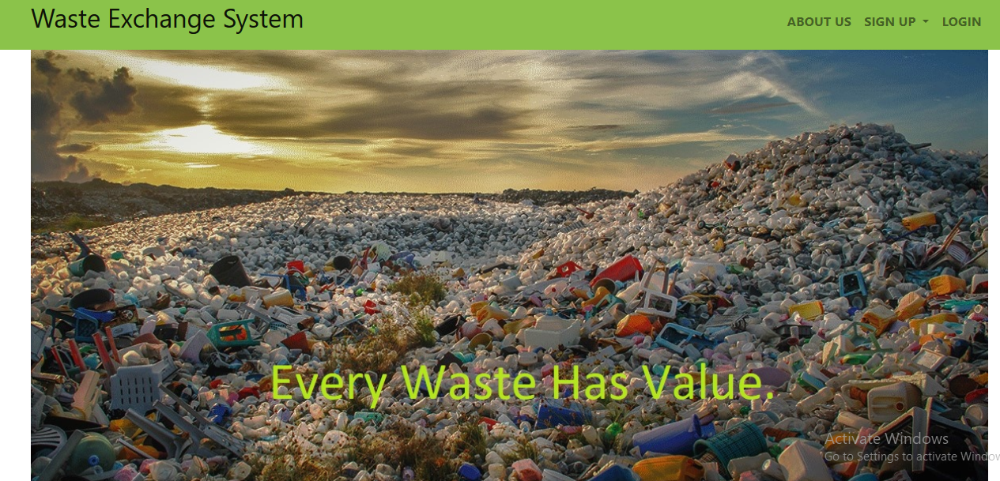
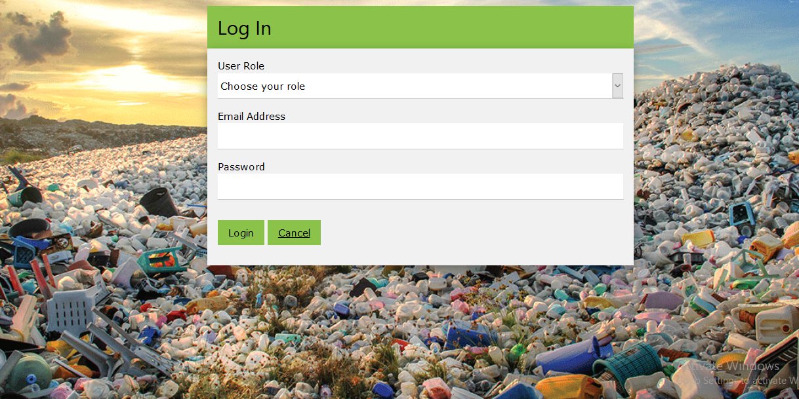
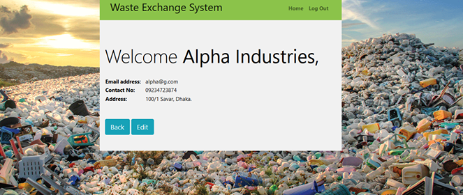
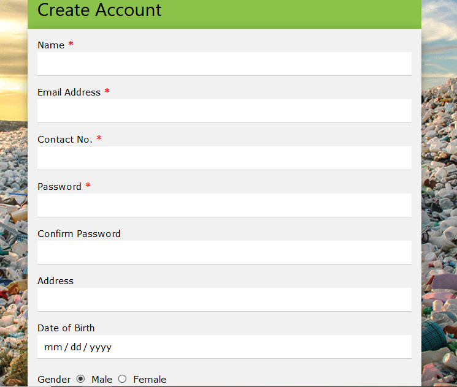

# WasteExchangeSystem
Web portal using PHP, HTML5, Bootstrap4, CSS, JS, MySQL and test plan with test cases. It is a system for connecting normal people with recycling companies. People can get reward or money in exchange of waste based on its quantity and type from the companies. This will encourage them not to throw away waste here and there and will provide a green population.

